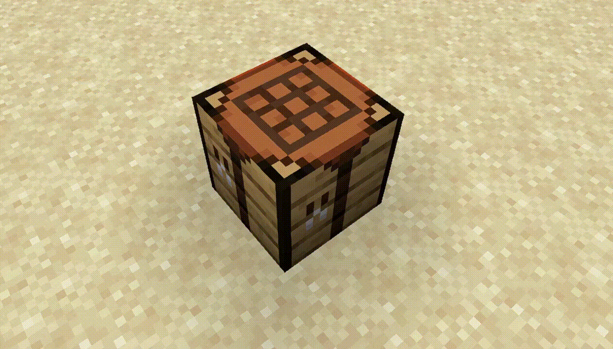

# Интерактивный мир

### Плакаты

Настенные плакаты — не обычные картины. При взаимодействии они отлетают от стены, переворачиваются и покачиваются, после чего плавно возвращаются на место. Некоторые варианты могут менять внешний вид.

Любой вид плаката можно редактировать: текст, декор и головы игроков. Административные плакаты правит только персонал, их опоры игроки не ломают. Подробности — на странице [Плакаты](plakaty.md).

### Диктофоны

Диктофоны содержат лорные аудиозаписи. Нажми **`ПКМ`** по устройству, чтобы оно поднялось с земли и начало воспроизведение.

### Интерактивные вазы

Нажми **`ПКМ`** по стоящей вазе без `Shift`, чтобы открыть её хранилище «Ваза» на 27 слотов. У каждой вазы своё содержимое, которое сохраняется после закрытия меню и перезапуска сервера. Пока хранилище открыто, вазу нельзя поднять.

Зажми **`Shift`** и нажми **`ПКМ`** по вазе, чтобы поднять её. **`ЛКМ`** бросает вазу по короткой физической дуге, а **`ПКМ`** отпускает строго вниз.

У установленной вазы есть настоящее твёрдое тело: на неё можно запрыгнуть, встать и поставить сверху другую вазу. Башня сохраняет точное свободное расположение без привязки к центру блока. Если нижнюю вазу убрать или поднять, стоящие на ней вазы падают.

### Фантомные предметы

Декоративные россыпи выглядят как выброшенные предметы, но их нельзя подобрать или сдвинуть блоком. Они сохраняются после перезапуска сервера и исчезают только по команде администратора.

<figure><figcaption></figcaption></figure>

### Осторожно: камнерез

Пила камнереза действительно опасна. Контакт с верхней частью блока наносит **три сердца урона каждые полсекунды**, даже если персонаж стоит неподвижно или касается лезвия краем.

### Предметы на верстаке

Когда игрок раскладывает рецепт в верстаке, окружающие видят предметы прямо на его поверхности — по сетке 3×3 и в правильной ориентации относительно мастера.

<figure><figcaption></figcaption></figure>

### Предметы на наковальне

Когда игрок кладёт материалы в две входные ячейки, окружающие видят их на поверхности блока: один предмет слева, второй справа.

Предметы не выпадают в мир, их нельзя подобрать — это только визуальное представление содержимого интерфейса. Сам игрок, работающий с наковальней, эти модели не видит.

<figure><figcaption></figcaption></figure>

### Ремонт наковален

Повреждённую наковальню можно восстановить железными слитками. Возьми слиток в основную руку и нажми **`ПКМ`** по наковальне. Один слиток восстанавливает одну ступень повреждения; целая наковальня железо не расходует.
