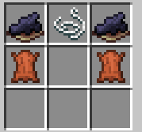

# Балаклавы

**Балаклава** скрывает личность игрока. Когда она надета на голову, попытка познакомиться с игроком не раскрывает его ник — вместо имени появляется сообщение:

> Вы не можете понять, кто это...

Балаклава работает как носимый головной убор и имеет отдельный внешний вид в инвентаре и на персонаже.

## Крафт

<figure><figcaption>Рецепт балаклавы</figcaption></figure>

Разместите ингредиенты на верстаке следующим образом:

| Верхний ряд | Чернильный мешок | Нить | Чернильный мешок |
| --- | --- | --- | --- |
| Средний ряд | Кожа | Пусто | Кожа |
| Нижний ряд | Пусто | Пусто | Пусто |

На выходе получается одна **Балаклава**.
