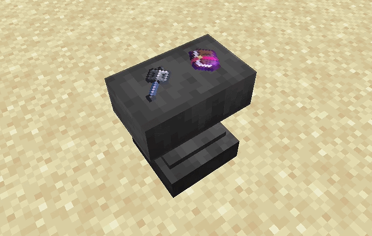

# Предметы на наковальне

Когда игрок кладёт материалы в две входные ячейки, окружающие видят их на поверхности блока: один предмет слева, второй справа.

Предметы не выпадают в мир, их нельзя подобрать — это только визуальное представление содержимого интерфейса. Сам игрок, работающий с наковальней, эти модели не видит.

<figure><figcaption></figcaption></figure>
